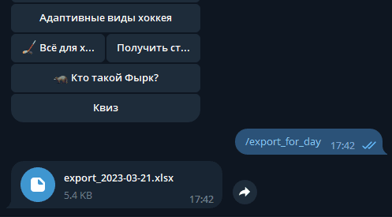
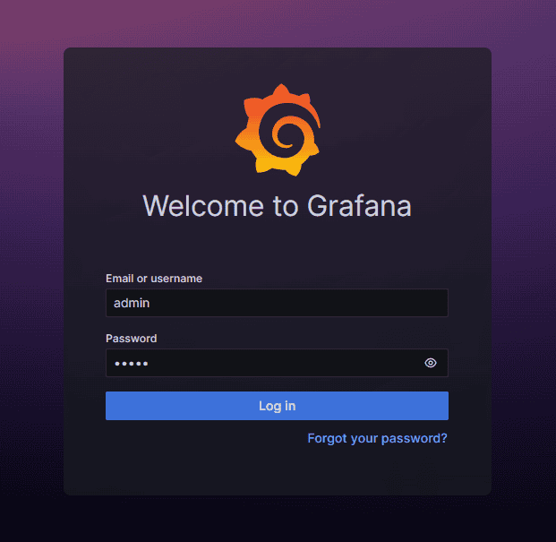
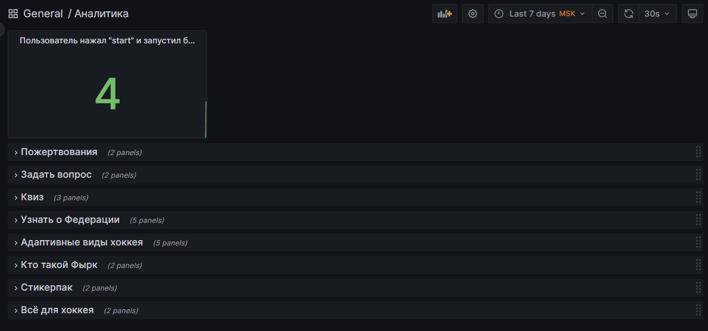
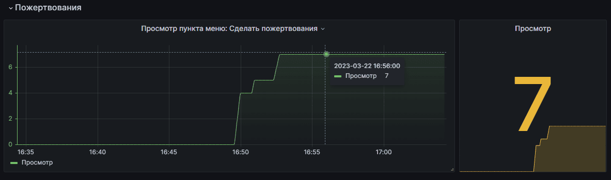
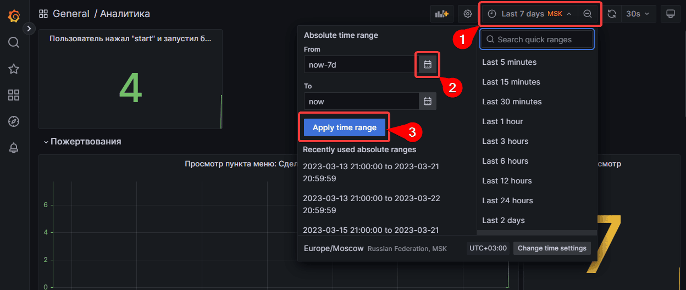
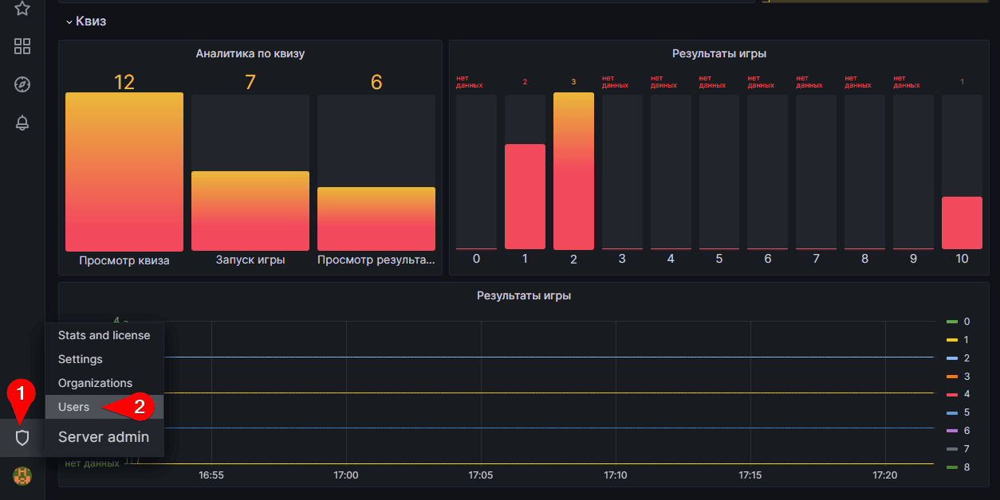
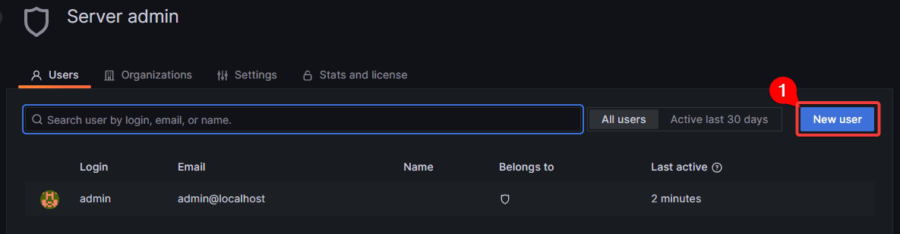
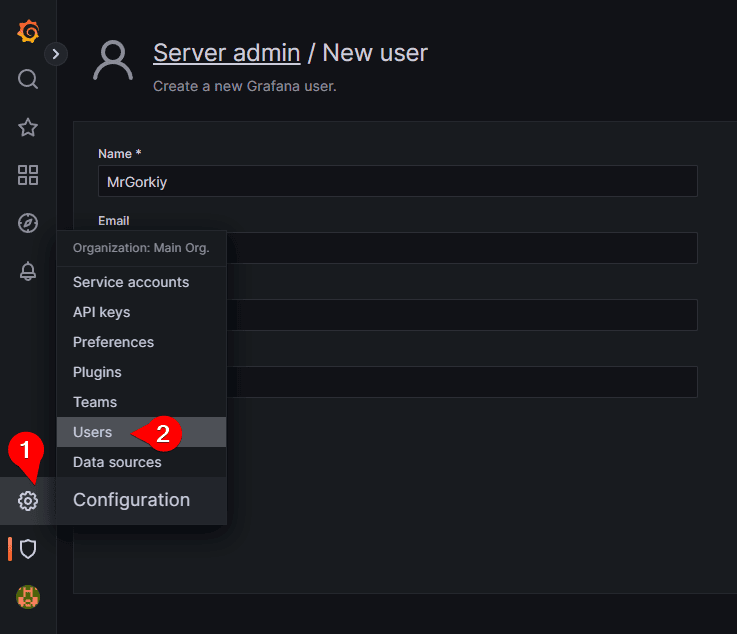
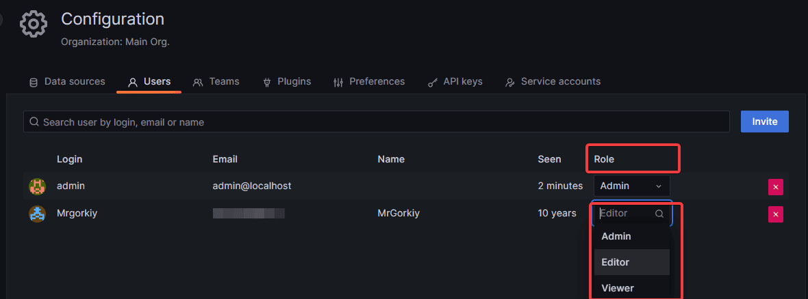

# FAQ Мониторинг
___
Панель мониторинга для просмотра аналитики, реализованный с помощью сервисов
Grafana и Prometheus.

> #### Содержание 
> * [Экспорт Telegram](#telegram)
> * [Сайт мониторинга](#grafana)
>  * [Создание пользователя](#add_user)
> * [Project Paraicehockey](https://github.com/Studio-Yandex-Practicum/paraicehockey/)

___
## Просмотр аналитики: 
Доступ к аналитике можно получить несколькими способами:

### Экспорт данных через Telegram бота

Адрес бота для экспорта данных https://t.me/ParahockeyBot

`/export_for_day` - экспорт данных аналитики за день

`/export_for_week` - экспорт данных аналитики за неделю

*Доступ для экспорта данных через Telegram бота ограничена*

[⬆ Оглавление](#contents)

---
### Онлайн доступ через сайт мониторинга 

Просмотр аналитики доступен по адресу: https://sledge.vvdev.ru/stats/
> Данные для авторизации:
> * Логин: admin
> * Пароль: admin

После входа, нам будет предложено сменить пароль или пропустить, в дальнейшем
сменить пароль можно будет через меню настроек или при повторном входе.

**Пароль рекомендуется сменить.* 

На главном экране отображается собираемая статистика расположенная в отдельных
 блоках:
* Задать вопрос
* Узнать о Федерации
* Адаптивные виды хоккея
* Сделать пожертвования
* Квиз
* Кто такой Фырк
* Стикер-пак
* Всё для хоккея

Данные аналитики выводятся в виде графиков.
В графике есть возможно просмотреть подробную статистику, в отдельном окне 
"Просмотр" отображается последний данные статистики дублирующий данные графика.
Подобная логика распространяется на все данные статистики.

В сервисе предусмотрено отображение данных статистики за определенный период 
времени, стандартно данные отображаются за 7 дней.
Для того чтобы изменить период отображаемых данных перейдите на панель 
управления (1) и измените временной диапазон (2), после чего примените 
изменения (3).  Сервисом предусмотрен стандартный набор 
пред-установок, он отображается в правой части выпадающего меню.

[⬆ Оглавление](#contents)

### Добавление новых пользователей 

Для добавления новых пользователей перейдите в меню администрирования (1) и 
выберете пункт `Users` (2)

Далее нажать на кнопку `New user` и заполнить требуемые данные. Тут же можно 
управлять текущими пользователями: удалять, деактивировать, редактировать.

Если требуется можно установить права доступа для нового пользования, значение 
по умолчанию `Viewer`, в пункте `Role` внесите изменения.

> Справка по ролям:
> * `Viewer` - может просматривать панели мониторинга.
> * `Editor` - может просматривать и редактировать панели мониторинга, 
> папки, группы.
> * `Admin` - имеет доступ ко всем ресурсам организации, включая панели 
> мониторинга, пользователей и команды.
 
[⬆ Оглавление](#contents)
